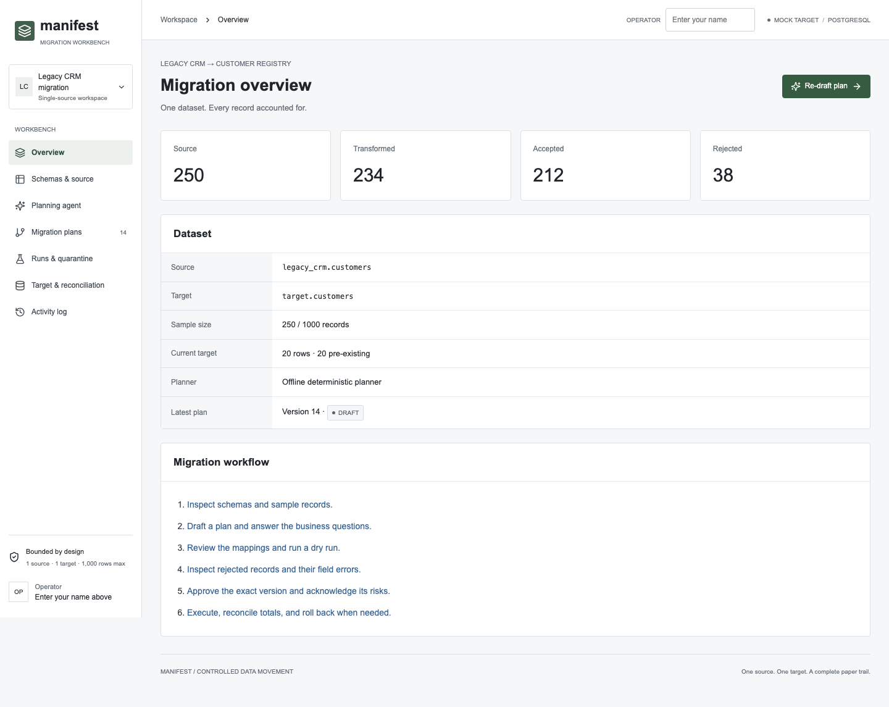

# Agentic Data Migration Planner and Reconciliation Workbench

**Manifest** plans and validates a controlled migration from a messy legacy CRM export into a strict customer registry. A tool-restricted planning agent proposes the mappings; a human reviews the decisions and approves an exact plan version before anything can be inserted.

The workbench preserves rejection evidence, proves that retries do not duplicate rows, reconciles the destination, and can roll back only the rows it owns.



## Run locally

Use Node.js 22 and pnpm 10.18.0.

```sh
pnpm install
cp .env.example .env
pnpm db:generate
```

Start Postgres in another terminal:

```sh
docker compose -f docker/compose.yml up -d
```

Or, if Docker is unavailable, run `pnpm db:local`. This launches an actual local PostgreSQL server on port 54329 and creates `manifest` and `manifest_test`. Keep that terminal open. Its files live in the ignored `.local-postgres` directory.

Then:

```sh
pnpm db:deploy
pnpm db:seed
pnpm dev
```

Open the URL printed by Next.js, normally `http://localhost:3000`. If that port is occupied, Next.js chooses the next available port.

Seed operations are idempotent and never reset an existing workspace. They create **250 source records** and **20 pre-existing target customers**.

## Walk through the migration

1. Inspect both schemas and profile source fields.
2. Draft a plan. Without `GROQ_API_KEY`, the offline deterministic planner performs the same read-only tool calls as the model-backed path.
3. Answer the seven business questions and re-draft. Each save creates a new immutable version.
4. Enter your operator name and run a dry run. Inspect quarantine errors and transformation traces.
5. Review the high risks and sign the exact plan version and dry-run fingerprint.
6. Execute into the mock target. Turn on the interruption simulator to stop after the third committed batch.
7. Retry safely. The first 150 rows are skipped because they were already loaded by the same migration.
8. Reconcile counts, keys, row content and the total credit limit.
9. Roll back with a reason. Only migration-owned rows are removed; existing customers remain.
10. Inspect the append-only activity register.

The default decisions produce **250 source / 234 transformed / 212 accepted / 38 rejected**. An interruption after three batches inserts 150 rows; retry inserts the remaining 62 and skips 150. The target reaches 232 rows, then returns to 20 after rollback. Different approved business decisions can change these counts.

## Scope

- **Source:** `legacy_crm.customers`, staged as immutable JSON in PostgreSQL.
- **Target:** `target.customers`, a separate schema in the same database.
- **Maximum sample:** 1,000 records; the committed fixture has 250.
- **Transforms:** a closed, validated catalog. No arbitrary code, live connectors or production database migration.
- **Data ingestion:** the committed bounded fixture. A public upload workflow is outside this implementation.
- **Access:** one shared demo workspace, protected by an optional access code locally and a required access code on Vercel. Operator names are recorded labels, not verified personal identities.

## Stack and layout

Next.js 16, React 19, strict TypeScript, pnpm/Turborepo, Prisma 7 with the PostgreSQL adapter, Zod, Groq via fetch, Vitest, and Playwright. Neon is the intended deployed PostgreSQL host; Vercel hosts the application.

| Path                | Responsibility                                                                          |
| ------------------- | --------------------------------------------------------------------------------------- |
| `apps/web`          | Responsive workbench, mapping editor, APIs, session gate, browser tests                 |
| `packages/core`     | Pure transforms, static plan checker, canonical hashing, dry run, reconciliation        |
| `packages/agent`    | Eight permitted tools, model loop, offline planner, mandatory risk findings             |
| `packages/db`       | Prisma models, target SQL, transactions, approvals, execution, retries, rollback, audit |
| `packages/fixtures` | Schemas, reproducible sample records, seed customers, reference plan                    |
| `scripts`           | Local PostgreSQL launcher                                                               |

## Validation

```sh
pnpm format:check
pnpm lint
pnpm typecheck
pnpm test
```

For the PostgreSQL lifecycle tests, configure `TEST_DATABASE_URL` to a **dedicated test database**, then apply migrations to that database:

```sh
DIRECT_URL="$TEST_DATABASE_URL" pnpm db:deploy
pnpm test:integration
```

The integration suite seeds the test database if empty, exercises migration writes and content changes, and recovers interrupted test migrations using the application's rollback. Never point it at the deployed workbench.

For browser checks:

```sh
pnpm build
pnpm --filter web exec playwright install chromium
pnpm e2e
```

Browser tests run a production server on port 3100. They create real plans, approvals and migration history in `DATABASE_URL`; use a dedicated test workspace. CI provisions PostgreSQL automatically and checks the full flow plus mobile layout and cross-origin rejection.

## Deploy

[Neon and Vercel setup](docs/backend-setup.md) covers environment variables, migrations, the access code and the deployment order. No cloud credentials are committed. Deployment awaits account credentials.

Read [architecture](docs/architecture.md), [implementation decisions](docs/decisions.md), and [the demo script](docs/demo-script.md) for the invariants and verification walkthrough. [PLAN.md](PLAN.md) contains the original design; the README and implementation notes describe the shipped scope and any changes from that plan.
