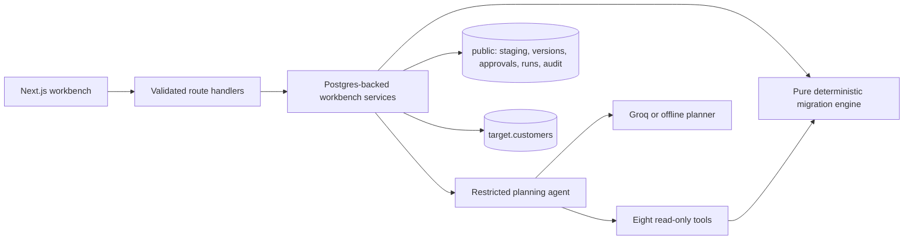

# Architecture and invariants

## Decisions before writes

An immutable plan records every target mapping, the ordered catalog transformations, explicit source drops, a duplicate policy, and the validation reference date. Every staged field must be mapped or explicitly dropped. Static checking validates transform types and required target fields before a plan is persisted.

A dry run reads ordered source rows and normalized target keys. It produces accepted and rejected outcomes, complete field errors and each transform's input/output trace. All evidence is persisted in `Run.result`; rejected outcomes in that snapshot are the quarantine. No separate copy of the data can drift away from its evidence.

Canonical JSON sorts object keys. The result fingerprint includes the plan hash, dataset hash, target-key hash, counts, outcomes and errors. Reordering input rows or target keys cannot change the result. Dates, numbers and currencies have fixed parsers. Time and randomness are absent from the core's transform path.

## Approval

Approval requires the exact plan fingerprint and a successful dry-run snapshot of that version. Source and target keys are re-read and the deterministic result is recomputed. Every blocking business question must be answered and every high risk acknowledged.

Plan and approval rows reject UPDATE and DELETE through database triggers. Editing always creates a new draft. Operator names are human-supplied attribution labels, not an identity provider.

## Execution and interruption

All state-changing lifecycle decisions acquire the same transaction-scoped PostgreSQL advisory lock. This works with Neon's transaction pooler. A partial unique index permits only one running execution. Before starting, the service rejects another live migration version and validates the approved snapshot again.

Each batch of 50 inserts is committed with its progress counters and audit event. `UNIQUE(legacy_id)` and `UNIQUE(email)` protect the destination. `ON CONFLICT (legacy_id) DO NOTHING` permits retrying an owned identical row; unexpected conflicts fail rather than silently disappear. Existing lineage rows are compared by actual content before retry.

Retries deliberately offer every accepted row again. They share the original lineage and record a new attempt. Skipped rows must have that lineage and expected hash. Successful repeated requests return the completed attempt and append a retry-noop event. A terminated process's reservation expires after two minutes; every later batch re-checks that the reservation is still valid.

The agent cannot insert, approve or roll back. Its tool registry contains schema reads, bounded samples, profiling, catalog listing, mapping tests, plan checking and proposal submission. Unsupported tools and malformed arguments are rejected and recorded. Model-provided risks cannot remove mandatory code-defined risks or business questions.

## Reconciliation and rollback

The destination is read in canonical UTC form, including when PostgreSQL's session timezone is not UTC. Reconciliation checks source accounting, quarantine count, lineage row count, total target count and integer credit cents. It also compares key sets and recomputes row content hashes.

Rollback checks actual migrated content and refuses to remove edited records. It deletes only rows with the requested lineage, updates all attempts in that lineage, records the reason and row count, and persists a post-rollback reconciliation. The 20 pre-existing rows have null lineage and cannot match the deletion predicate.

## History and access

Audit writes occur inside the same transaction as their lifecycle mutations. Audit UPDATE, DELETE and TRUNCATE are rejected by triggers. This is application-level immutability under the deployed role; a PostgreSQL owner who can drop tables or disable triggers is still an administrator.

The access-code session protects all workbench pages and API reads/writes. Origin checks reject cross-site mutations. The access code and session secret stay on the server. Source values and model text are rendered as ordinary React text. No untrusted HTML or arbitrary transform code is evaluated.
